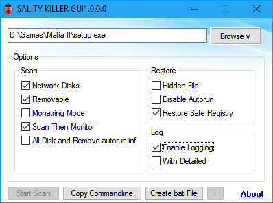

 
 
 
 

# SalitykillerGUI
Just created new tools from autoit scripting tools names Salitykiller GUI.Its a simple GUI for Salitykiller virus killer command line tool from kaspersky. Which is difficult for newbies.Here simple GUI is allow to use Salitykiller Console application from GUI. There are few options are added like:
See the [change log](CHANGELOG.md) for changes and road map.

## Binaries
Download the source code or binary only in [SalitykillerGUI Releases](https://github.com/gajjartejas/SalitykillerGUI/releases/latest)

## Features 
- Simple and easy to use GUI.

## Screenshot

## Contribute
For cloning and building this project yourself, make sure
to install the
[AutoIt](https://www.autoitscript.com/site/autoit/) 
and
[AutoIt Script Editor](https://www.autoitscript.com/site/autoit-script-editor/downloads/)
For windows.

To compile this project Right click on  [SalitykillerGUI.au3](SalitykillerGUI.au3) and select Compile with Options.
This action opens a new dialog box. Hit compile button to compile, a compiled binary will generate on same folder.

## License
*GNU GENERAL PUBLIC LICENSE version 3* by [Free Software Foundation, Inc.](http://fsf.org/) converted to Markdown.
Read the [original GPL v3](http://www.gnu.org/licenses/).
